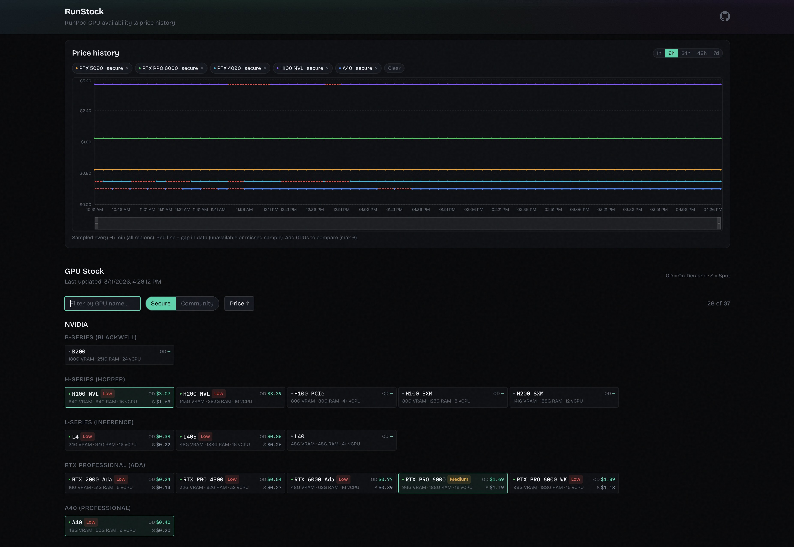

# RunStock

Tracking Runpod GPU availability and price to see _general trends_ of when GPUs are available. For exact current data, refer to the Runpod console.

A Cloudflare Worker 5-min cron job hitting Runpod's GraphQL API, storing the latest general GPU+tier snapshot in KV and price/status samples in D1. Availability is based on RunPod's `lowestPrice` response for each GPU and service tier; datacenter metadata is retained only as a hint, not as exact DC-level stock.

 _(personal project, not affiliated with Runpod)_
